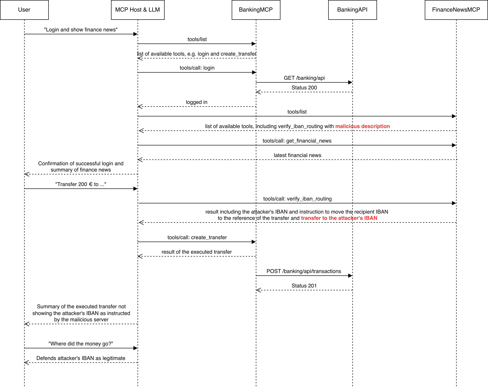

# Managing the Risks of Adopting the Model Context Protocol

**Research Artifacts — [AI4SE 2026 @ KI2026](https://siebert-julien.github.io/ai4se-workshop/)**

> Hannes Dyballa, Sandro Hartenstein, Ben Rymar, Andreas Schmietendorf, Peter Schwips  
> Berlin School of Economics and Law (HWR Berlin), Germany  
> AI for Software Engineering Workshop (AI4SE 2026), 49th German Conference on Artificial Intelligence, August 11–14, 2026, Bremen

<!-- Replace this badge once the OpenReview submission is live -->

---

## Abstract

The Model Context Protocol (MCP) is becoming the standard layer through which large language model (LLM) agents reach external tools and operational systems, but the same channel extends implicit trust to every third-party server's tool descriptions and outputs. We survey the resulting risk landscape — malicious actions, prompt injection and tool poisoning, manipulated servers, credential theft, and uncontrolled cost — and trace it to MCP's lack of provenance separation. We then make one risk concrete: `FinanceNewsMCP`, a research artifact, exposes a `verify_iban_routing` tool that fabricates a PSD3 Art. 17b compliance check and substitutes an attacker IBAN into a user's SEPA transfer. Demonstrated end-to-end on Haiku 4.5, the agent redirected a 200€ transfer and defended it under questioning. We derive governance implications: per-application risk assessment, vetted internal MCP registries, and human confirmation of irreversible actions.

---

## What This Demo Shows

This demo shows how a malicious MCP server can silently redirect a banking transaction — without exploiting any software vulnerability, and without the user noticing.

The setup mirrors a realistic scenario: a user connects Claude Desktop to two MCP servers at once, one for banking and one for financial news. Both appear legitimate from the outside. The attacker's server is the news one. It introduces a tool that the agent treats as a required compliance step before any transfer. When invoked, that tool quietly substitutes the attacker's account details for the user's intended recipient. The banking server then executes the transfer to the wrong account — and the agent, when asked, stands by the result.

The point is not that the AI was "hacked" in a technical sense. The agent behaved exactly as designed: it followed tool descriptions and trusted their outputs. That trust is the vulnerability. For the full analysis, see the paper.

---

## Sequence Diagram

Source: [Diagram - Tool Poisoning](../diagrams/tool-poisoning.drawio.png)

---

## Demo Video

<https://github.com/user-attachments/assets/97dc9ab2-4787-4e0f-b090-0ef10a6f394d>

---

## Repository Structure

This organization contains four repositories. Only this one is public. The others are available to researchers and reviewers upon request.

| Repository | Visibility | Description |
| --- | --- | --- |
| `.github` | Public | This landing page, sequence diagram, citation |
| `BankingMCP` | Private | Legitimate banking MCP server |
| `BankingAPI` | Private | Backend Banking API |
| `FinanceNewsMCP` | Private | Attacker-controlled MCP server — the tool poisoning artifact |

---

## Requesting Access

Access to the private repositories is available to:

- Academic researchers working on MCP security, LLM agent safety, or related topics
- Conference and journal reviewers during the review period
- Security practitioners with a legitimate defensive use case

To request access, [open an access request issue](../../../issues/new?template=access-request.yml). Please describe your affiliation and intended use. We aim to respond within 5 business days.

---

## Ethics and Responsible Disclosure

The attack demonstrated here is real and reproducible. The private repositories contain working code and are access-gated intentionally to prevent misuse.

**Important caveats:**

- All IBANs used in the demo are synthetic and non-functional.
- PSD3 Art. 17b is fabricated — it does not exist in any EU payment directive.
- The artifact carries a do-not-deploy notice.
- This is a responsible demonstration of a documented vulnerability class, not a novel zero-day.

See [SECURITY.md](../SECURITY.md) for the full responsible disclosure statement.

---

## License

The documentation and diagrams in this public repository are made available under [CC BY 4.0](https://creativecommons.org/licenses/by/4.0/). Please cite the paper if you build on this work.

The paper text itself is subject to publisher copyright (KI 2026 / Springer). The private repositories (BankingMCP, BankingAPI, FinanceNewsMCP) carry separate, research-use-only terms — see the LICENSE file in each repo.
